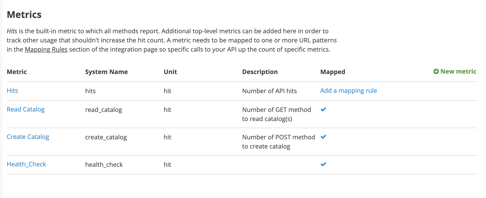
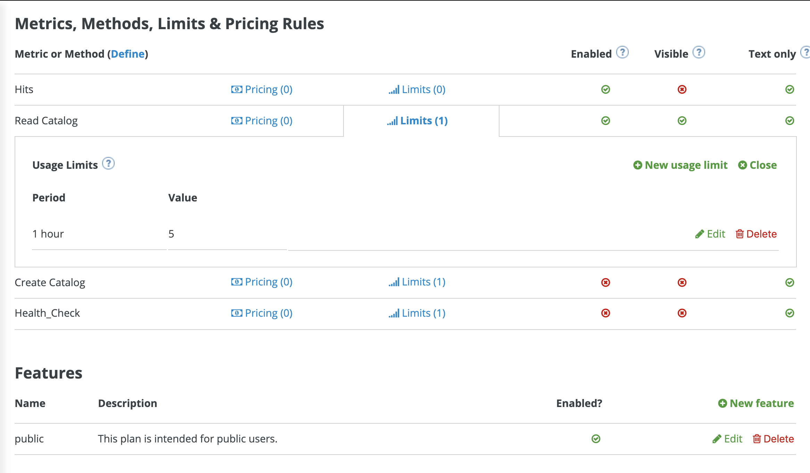
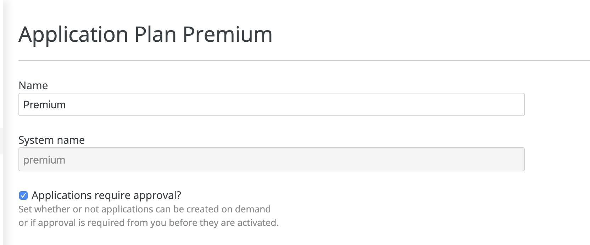
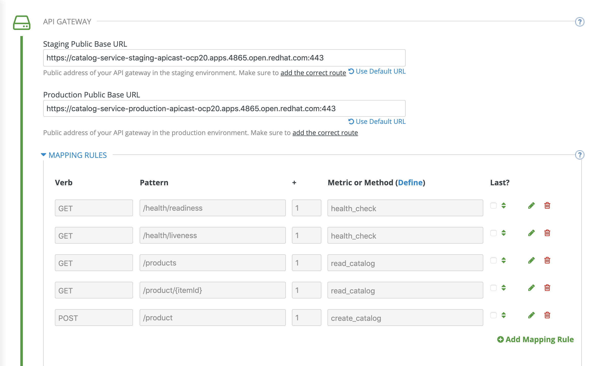
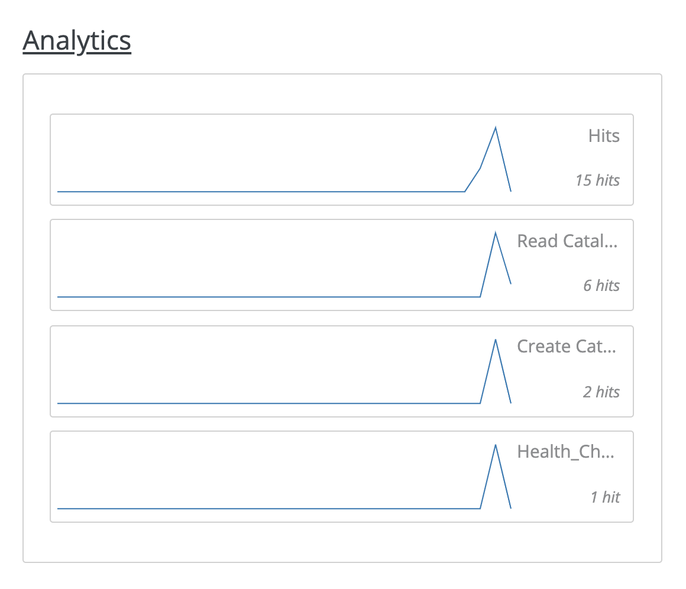
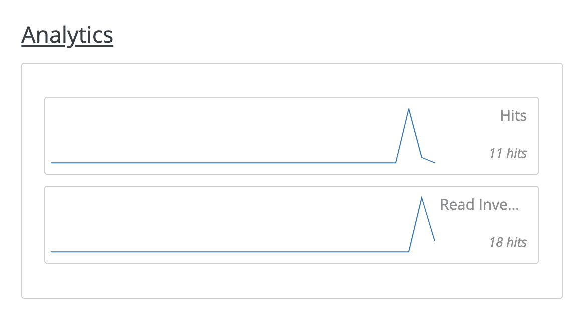
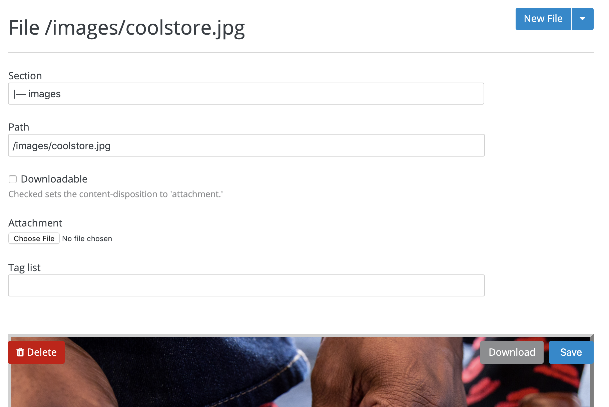
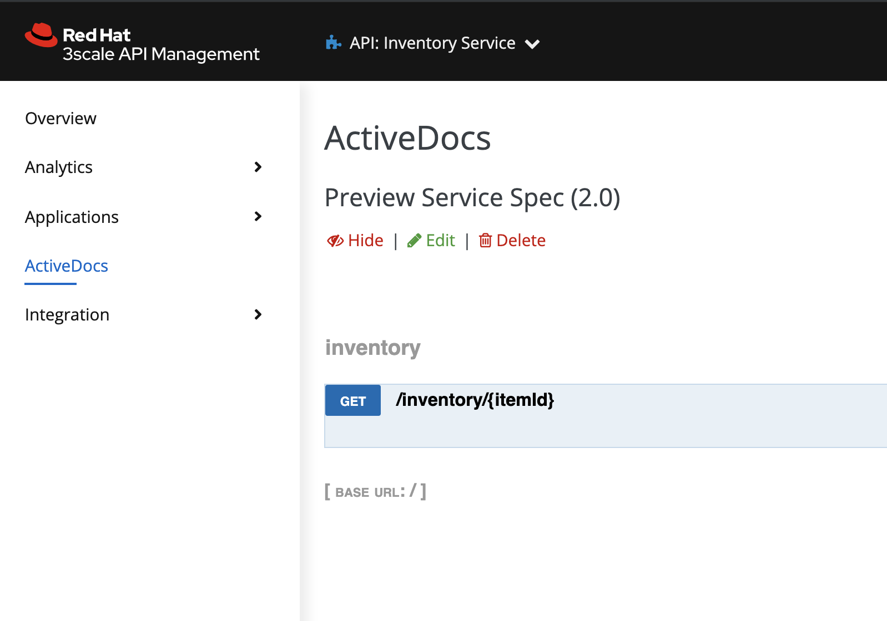

# Advanced Development with ​Red Hat 3scale API Management Assignment

Table of Content

 * [Introduction](#introduction)
 * [API Service Setup section](#api-service-setup-section)
 * [Methods, Metrics, Rate Limits Setup section](#methods-metrics-rate-limits-setup-section)
    - [Catalog Application](#catalog-application)
    - [Inventory Application](#inventory-application)
 * [User Signup Setup section](#user-signup-setup-section)
    - [Development Portal and API Docs section](#development-portal-and-api-docs-section)
    - [Development Portal](#development-portal)
 * [API Docs](#api-docs)
 * [Authors](#authors)


## Introduction
Scenario for assignment is developing a new online retail platform branded "CoolStore" for WebRetail Inc., through which their partners can provide a catalog and inventory to sell products through the platform.

## API Service Setup section

Following shell scripts are used for  provisioning Catalog and Inventory Service on OpenShift

* Create Apps and their config maps: [setup.sh](scripts/setup.sh)
* Label and annotate service for enable 3Scale auto-discovery: [label-and-annotate-svc.sh](scripts/label-and-annotate-svc.sh)
* Route for APICast (Automatic route creation is disabled): [create-route.sh](scripts/create-route.sh)


## Methods, Metrics, Rate Limits Setup section

Each application contains 2 plans. Basic and Premium. Basic plan will limit for 5 call per hour and only Read (GET) operation is enabled.

### Catalog Application

Metrics for catalog application


Plans for catalog application
Remark that "public" features is added. This feature is used by liquid script to control portal to display only application with this feature.

Basic plan with rate limit and enable only "Read Catalog"


Premium plan


Enable approval for premium plan


Mapping metrics with mapping rules


Analytics information will be mapped by each operation


### Inventory Application
3Scale configuration for Inventory application is very same with Catalog application. 
Currently Inventory application contains only read operation.



## User Signup Setup section
New partial [public-only-signup-partial.liquid](liquid/cpublic-only-signup-partial.liquid) is created for mulitple signup and display only API with feature name "public"

Following code are for filter to display only feature name "public"

```
...

        
        
        <h2> {{ service.name }} </h2>
...
```

## Development Portal and API Docs section
### Development Portal
For custom look & feel UI, Create new layout [coolstore-layout.liquid](liquid/coolstore-layout.liquid) form default layout and change stylesheet to display new banner.

```
...
<style>
    body {
      background-color: #7F8F00;
      /* fallback */
      background-color: rgba(131, 146, 16, 0.98);
    }

    .page-header {
      background-image: url(/images/coolstore.png);
    }
  </style>
...
```

Banner coolstore.png need to be uploaded


Set default Homepage to use our layout


Homepage is slighlty modified for display WebRetail name.
```
...
<div class="row">
      <div class="col-md-12">
        <h1>Web Retail API</h1>
         <p>
          <i class="fa fa-sign-in fa-3x pull-left"></i>
          Powered by: 
          </p> 
      </div>
    </div>
...
```

### API Docs
3Scale support OpenAPI/Swagger with ActiveDocs. Following show activeDocs for Inventory



For Developer Portal to display correct authentication information which configured by 3Scale. Paramater named "x-data-threescale-name" need to be added.

```
...
"parameters": [
          {
                    "name": "user-key",
                    "in": "header",
                    "description": "Your API access key",
                    "required": true,
                    "x-data-threescale-name": "user_keys",
                    "type": "string"
                }
         
        ],
...
```

Swagger's host and scheme also needed to be modified according to your protocol and route host name.

```
...
"schemes": [
    "https"
  ],
  "host": "catalog-service-production-apicast-ocp20.apps.4865.open.redhat.com:443",
...
```

By default, Developer Portal show only the 1st API docs. New partial [swagger-ui-partial.liquid](liquid/swagger-ui-partial.liquid)  is created to support for display multiple OpenAPI/Swagger doc.

Modified original Documentation pages to include above partail.

```
...

...
```

## Authors

* **Voravit** 

